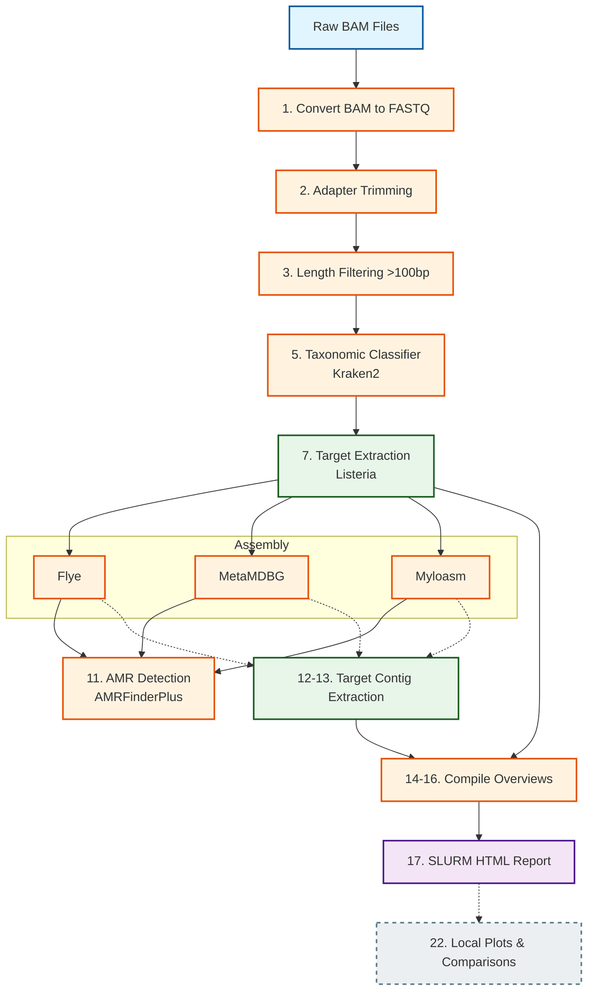

# Listeria Adaptive Sampling Pipeline

This repository contains a full analysis workflow for Oxford Nanopore sequencing data, focused on *Listeria* detection and characterization from mixed microbiome samples.

It is designed for high-performance computing batch execution (SLURM), but can also be run locally for smaller tests.

---

## Why this matters for food safety
*Listeria monocytogenes* is a foodborne pathogen that can survive in food-processing environments and cause severe disease. Rapidly detecting *Listeria* signal directly from sequencing data, without needing days of cell culturing, helps food safety teams act faster during contamination checks and outbreak investigations.

## What is Adaptive Sampling?
Adaptive sampling is a real-time enrichment approach during Nanopore sequencing. As DNA passes through a sequencing pore, the instrument basecalls the first part of the read, compares it to a target reference, and decides to either:
- **Keep** sequencing the read if it looks like target DNA.
- **Eject** the read early if it looks off-target.

This drastically increases the sequencing yield for targets of interest (like *Listeria*) without the need for complex physical enrichment in the wet lab before sequencing.

## The Goal: Benchmarking AS vs Native (N) Sequencing
The original use-case for this pipeline is directly comparing **Adaptive Sampling (AS)** against **Native (N)** (un-enriched) sequencing runs of the same samples.

The pipeline is explicitly designed to handle datasets where each sample was run both ways. It outputs aggregated comparisons on:
- **Total Yield vs Length Dropout**: Analyzing how the 100bp length filter differentially affects AS (often ~30% dropout) versus N (often ~70% dropout) due to the ejection mechanics.
- **Target Enrichment Percentage**: Measuring the relative abundance of the target organism (e.g. *Listeria*) compared to the total microbiome background in AS versus N.
- **Assembly Quality**: Comparing the length and coverage of final target-specific contigs when assembled from AS-enriched reads versus N reads.

If your dataset contains matched pairs (e.g. `barcode01_AS` and `barcode01_N`), the pipeline will automatically group them in the final HTML report and generate direct side-by-side distribution plots.

---

## Pipeline Architecture



---

## Quick Start

### 1) Create Environment with Mamba
```bash
mamba create -n listeria_as \
  python=3.10 \
  samtools porechop nanofilt nanostat kraken2 seqtk seqkit \
  flye metamdbg myloasm minimap2 racon ncbi-amrfinderplus \
  pandas numpy scipy matplotlib \
  -c conda-forge -c bioconda --strict-channel-priority

mamba activate listeria_as
```

### 2) Install Dorado Basecaller & Polisher
Dorado must be installed manually outside of Mamba. See [docs/01_installation.md](docs/01_installation.md) for full instructions on downloading the binary and models.

### 3) Run Orchestrator

1. **Clone the repo** and enter it.
2. **Edit path variables** in `scripts/submit_pipeline.sh` (replace `/path/to/project` with your real paths).
3. **Run the orchestrator script:**
    ```bash
    bash scripts/submit_pipeline.sh
    ```
    This orchestrator submits and links the full workflow (steps 1 to 20), and gracefully skips outputs that have already been generated.

---

## Documentation Table of Contents

We have broken down the pipeline documentation into specific guides to make it easier to digest:

1. **[Installation and Setup](docs/01_installation.md)**
   - How to install Mamba and set up the Conda environment.
   - Where to download the Kraken2 and AMRFinderPlus databases.
   - Official documentation links for all tools used.

2. **[Pipeline Workflow and Architecture](docs/02_pipeline_steps.md)**
   - A step-by-step breakdown of what every script (`01` through `22`) accomplishes.
   - An explanation of the specific command-line flags used in the tools.

3. **[Execution and Troubleshooting Guide](docs/03_execution_guide.md)**
   - How to run the pipeline on a SLURM high-performance cluster.
   - How to manually execute steps locally.
   - Common errors (e.g., missing Kraken DBs) and fast checks.

4. **[Adapting the Pipeline](docs/04_adapting_pipeline.md)**
   - How to use the `sample_metadata_template.csv` to map barcodes to real sample conditions.
   - How to easily change the target regex logic to extract **Salmonella**, **E. coli**, or any other organism instead of *Listeria*.

---

## Final Note
If you only change one thing before running: make sure **every placeholder path** is replaced with real paths for your system. Most failed runs come from path mismatches!
